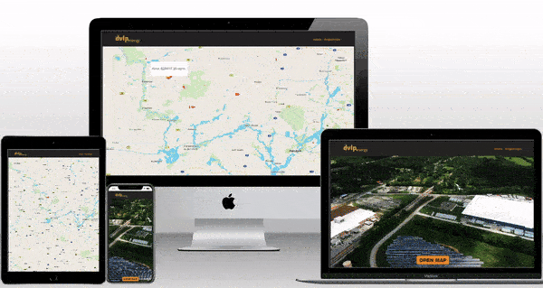
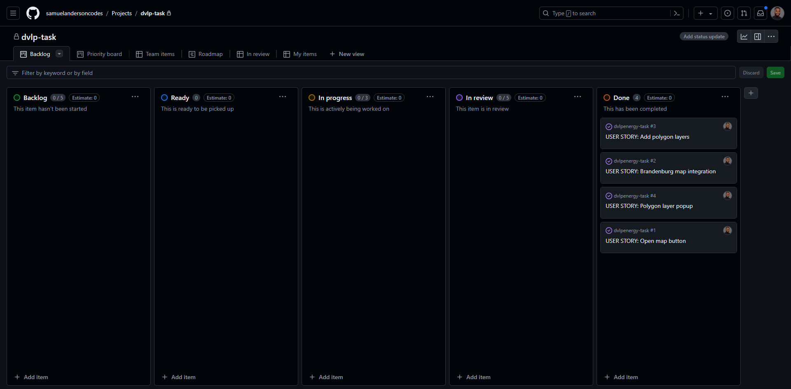
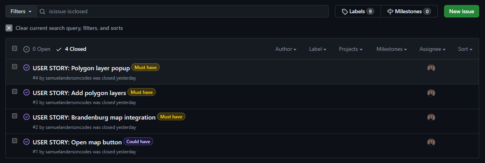
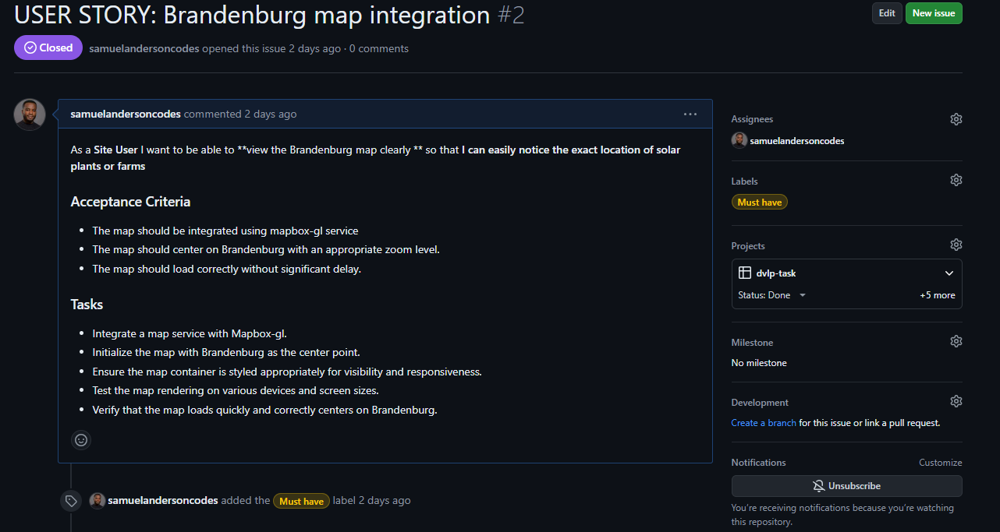
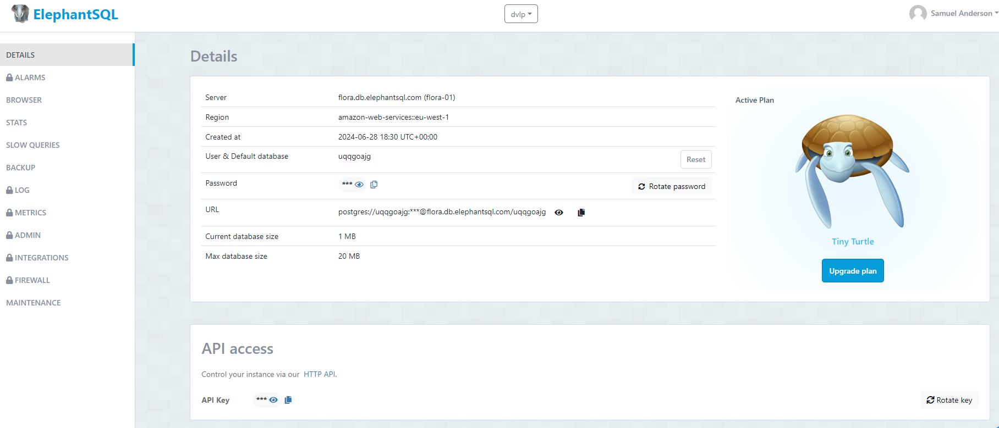

# dvlpenergy-task

The dvlpenergy-task web application is a Fullstack application developed with React and the Django RestFramework. The ElephantSQL database is used to store the geoJSON data that feeds the geometry polygon onto the map.
The application therefore renders a basemap of Brandenburg and indicates with polygon layers where solar plants are situated. The total land area of the solar plants are displayed in square meters upon a click.  

The live link can be found here: [Live Site - dvlpenergy-task](https://dvlpenergy-task-4229b9c60fd6.herokuapp.com/)

## Table of Contents
- [dvlpenergy-task](#dvlpenergy-task)
  - [Table of Contents](#table-of-contents)
- [User-Experience-Design](#user-experience-design)
  - [The-Strategy-Plane](#the-strategy-plane)
    - [Site-Goal](#site-goal)
    - [Agile Planning-and-Process](#planning-and-process)
      - [Steps](#steps)
          - [Backend Django Setup](#Backend-Django-Setup)
          - [ElephantSQL Database Setup](#ElephantSQL-Database-Setup)
          - [Frontend React Setup](#Frontend-React-Setup)
          - [Model Creation](#Model-Creation)
          - [URL Configuratgion](#URL-Configuratgion)
          - [Map Integration and Data Fetching](#Map-Integration-and-Data-Fetching)
          - [Home Page](#Home-Page)
      - [User Stories](#user-stories)
  - [The-Skeleton-Plane](#the-skeleton-plane)
    - [Database-Design](#database-design)
    - [Security](#security)
  - [The-Surface-Plane](#the-surface-plane)
    - [Design](#design)
    - [Colour-Scheme](#colour-scheme)
    - [Typography](#typography)
    - [Imagery](#imagery)
  - [Technolgies](#technolgies)
  - [Testing](#testing)
  - [Deployment](#deployment)
    - [Version Control](#version-control)
    - [Heroku Deployment](#heroku-deployment)
  - [Credits](#credits)

# User-Experience-Design

## The-Strategy-Plane

### Site-Goals

This web application is aimed at displaying the map of Brandenburg with plotted polygon layers of solar plants.
When the user clicks on the polygon layer marked red, the total area of the polygon pops up in square meters.

### Agile Planning-and-Process

As soon as I got the task, I begun to brainstorm.
I thought it wise to make use of almost all the applicable technologies I have learnt so far.
I then started researching into the feasibility of my plan to use React with Vite for the frontend and the Django REST Framework for creating the API endpoint for the backend.

As soon as I was certain, I created a sample logo for patency reasons with Canva.
I then created the [dvlpenergy-task repository](https://github.com/samuelandersoncodes/dvlpenergy-task) and begun to jot down the rough idea I have and how to go about it, as well as the order in which I will be building the web application.

Subsequently, I used the Kanban board to plan the main segments of the development.

With that, I had only four main issues set in order of priority due to time constraints. 
It comes along with its respective user stories, acceptance criteria and tasks. For example, the main priority was to get the map well integrated so that I can continue to build upon it. 

## Steps

### 1. Backend Django Setup 
I first created my Django project in the [dvlpenergy-task repository](https://github.com/samuelandersoncodes/dvlpenergy-task) with the command 'django-admin startproject solar_farm_map .' after I have cloned the aforementioned repository with 'git clone https://github.com/samuelandersoncodes/dvlpenergy-task.git'

I then changed the directory to the Django project level with the 'cd solar_farm_map' command.

Thereafter, I created my 'brandenburg_plants' app with the 'python manage.py startapp brandenburg_plants' command.

I straight away created my virtual environment with 'python3 -m venv .venv' and activated it with '. .venv\Scripts\activate', always making sure that it is activated before I hit a key. 

Furthermore, I installed Django and the core necessary libraries. For instance, the Django RESTframework with the 'pip install django djangorestframework' and subsequently did so for the other libraries as needed.

I configured settings in the 'settings.py' file of the project, created the env.py file to store the django secret key and also added the new app to the installed apps section. Afterwards, I created my superuser with the 'python manage.py createsuperuser' command, migrated changes with 'python manage.py migrate' and made sure the site fires without errors. I finally added the .venv, sqlite3 and subsequently the staticfiles files to the gitignore file.

### 2. ElephantSQL Database Setup

Since I already have an ElephantSQL account, I just signed in and created a new instance for this particular project. I chose the 'Tiny Turtle' plan since the data is not so huge, named it 'dvlp' and selected the nearest region 'amazon-web-services::eu-west-1' as seen here;
I copied the database url and added it to my env.py file.

After that, I set up the database in the settings file. In my bash terminal, I ran 'pip3 install dj_database_url==0.5.0 psycopg2' for the database connection dependencies and updated the requirements.txt file with which I created earlier on 'pip freeze > requirements.txt' and then imported the 'dj_database_url'. To confirm the connection, I 'ran python3 manage.py showmigrations' and then migrated the changes. I then created a 'management/command/load_data function to load the geoJSON fixture and confirmed the data in the browser/Table queries section of the ElephantSQL database.

### 3. Frontend React Setup

In the repository's root directory, I created the react app with Vite; 'npm create-vite@latest frontend --template' and chose TypeScript. I swichted to the frontend directory with 'cd frontend', ran installation; 'npm install", and run the server with 'npm run dev'. I then did all the vital additional installations including mapbox-gl which I will most definitely need. After confriming that my server runs smoothly, I created a .env file to keep frontend secret keys, ignored it in the gitignore file and got it committed.

### 4. Model Creation

In my Models.py file of the brandenburg_plants app, I defined the SolarPlant model with name and geometry fields, made migrations with the 'python manage.py makemigrations' and the 'python manage.py migrate' commands.

To enable API interactions with the SolarPlant model, I used the Django REST Framework serializer to ensure that instances of the SolarPlant can be converted to JSON and parsed back into model instances, facilitating smooth data exchange in the API. I only serialized the id, name and geometry fields for the purpose of the project. The name field seemed redundant since the solar plants in the 'bb_solar_plants.geojson' file had no names but I felt it could be useful for a later data enrichment and API usability.

I then created a viewset for viewing and editing SolarPlant instances. It provides CRUD actions for solar plant objects. It also uses the Solar plant serializer for data serialization and deserialization.

### 5. URL Configuratgion

I created a urls.py file at the app level, imported path, include, DefaultRouter from the restframework. I then set the router and registered it to the SolarPlantViewSet. I added the path to the urlpatterns and included the app url in the main urls.py file at the project level.

### 6. Map Integration and Data Fetching

The data fetching was done with the JavaScript 'fetch' method in the frontend, after I mocked the API to confirm that the data loads properly.
Before I fetched the data, I imported mapbox-gl (mapbox-gl already installed in previous steps) and made sure that it is well integrated into the frontend React component 'solarplantsmap/SolarPlantsMap.tsx' with the given access token (access token stored in the git ignored .env file).

Integration with Mapbox involved initializing a map instance within a React useEffect hook. This initialization process included setting up the map's container, style, center coordinates and zoom level. An event listener was implemented to handle map loading events, ensuring that the map initializes properly before proceeding with data visualization.

I configured the component to asynchronously request data from the Django backend API endpoint. The fetching process was thoroughly tested, ensuring that data loads reliably and conforms to the expected format. 

Upon successful retrieval, I transformed the fetched data(initially in JSON format) into geoJSON features suitable for mapping with Mapbox.

Each solar plant entry was mapped to a geoJSON feature with the forEach method (I used the forEach method in order for me to manipulate the existing data and not its copy). 
Alongside the Installation and importation of the proj4 library, I created a function outside of the 'SolarplantsMap' component to normalize the geometries from the EPSG:3857 projection to EPSG:4326 for compatibility with Mapbox's mapping interface and parse it to the geometry of the features. I also set the properties with index as its id for proper data retrieval and manipulation, especially for adding layers and the popup functionality.

Data visualization on the map was then achieved by dynamically adding geoJSON sources with mapbox's 'addSource' method and polygon layers with the 'addLayer' method for each solar plant feature. Each layer was styled with the mapbox-gl css library to visually represent solar plant locations, using the red color and opacity to distinguish different data points (I used the [mapbox documentation](https://docs.mapbox.com/mapbox-gl-js/guides/) as a guide). 
I implemented Popups displaying total area information on clicking each solar plant polygon layer with the turf library.

I used the 'try-catch' block to make sure data-fetching errors are handled properly and finally cleaned up the map initialization upon component unmount.

### 7. Home Page 

In the end, I built a home page for the web app to look aesthetic. The home page comes with a video background of a solar farm with a 'Open Map' button that leads to the map.

A simple navbar(with logo, home and project repository link) as well as a footer(with copyright and project repository link) were implemented.

The project was finally tested (test can be found here; [Testing](#testing) ) and deployed to heroku(the deployment details can be found here; [Deployment](#deployment) )

### Database-Design

The database was designed to allow CRUD functionality on the Django [REST Framework interface](https://dvlpenergy-task-4229b9c60fd6.herokuapp.com/api/solar_plants/) of the project and was purposefully created to serve geoJSON data to the frontend.

It has only one simple model without any Foreign key so I therefore feel no need to make an Entity Relationship Diagram for it.

### Security

Environment variables were stored in an env.py and .env files respectively for local development for security purposes to ensure no secret keys, access token or sensitive information were commited to the repository. In production, these variables were added to the heroku config vars.

Django corsheader and CRSF settings were configured to secure the site in production.

## The-Surface-Plane
### Design

### Colour-Scheme

The main color schemes for the website are orange rgb(222, 153, 33) mostly found on the links, logo and the 'Open Map' button. While gray #242424 is used as background colour. The copyright text comes as an exeption with a white colour.

### Typography

The Inter font together with (system-ui, Avenir, Helvetica, Arial, sans-serif in order of priority as backup fonts) was used throughout the website for text.

